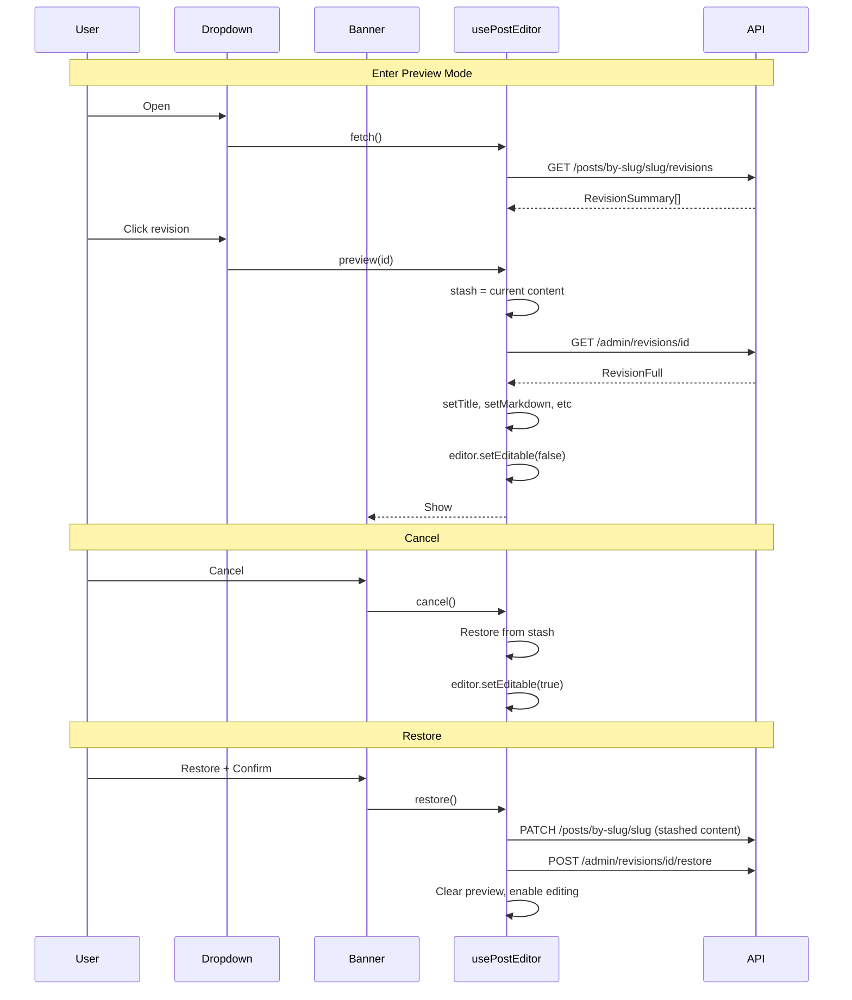

# Revision History Feature

## Overview

Add a History button to the EditorToolbar that opens a dropdown showing recent revisions. Clicking a revision enters "preview mode" where the editor content is temporarily replaced with the revision (read-only). User can Cancel (return to original) or Restore (auto-save current content first, then apply revision).

## Key Requirements

1. History button in toolbar (after MD toggle)
2. Dropdown shows recent revisions with timestamps
3. Clicking revision enters read-only preview mode
4. Preview banner with Cancel/Restore buttons
5. Restore confirmation dialog
6. Auto-save current content before restoring (creates undo point)
7. Escape key cancels preview
8. Works in both markdown and rich text modes

---

## Technical Foundation

### TiptapEditor Auto-Syncs

The TiptapEditor has built-in sync in [components/TiptapEditor.tsx](components/TiptapEditor.tsx):

```tsx
useEffect(() => {
  if (editor && content !== undefined) {
    const currentMarkdown = htmlToMarkdown(editor.getHTML())
    if (currentMarkdown !== content) {
      editor.commands.setContent(markdownToHtml(content), { emitUpdate: false })
    }
  }
}, [editor, content])
```

This means: just call `setMarkdown()` and Tiptap updates automatically.

### Making Editor Read-Only

- **Tiptap**: `editor.setEditable(false)` / `editor.setEditable(true)`
- **ArticleHeader**: Add `disabled` prop
- **Markdown textarea**: Add `readOnly` prop

---

## Files to Create/Modify

### 1. Revision Types

**File:** `lib/editor/types.ts` (new)

```ts
export interface RevisionSummary {
  id: string
  title: string | null
  createdAt: string
}

export interface RevisionFull extends RevisionSummary {
  subtitle: string | null
  markdown: string
  polyhedraShape: string | null
}

export interface StashedContent {
  title: string
  subtitle: string
  markdown: string
  polyhedraShape: string
}

export interface RevisionState {
  list: RevisionSummary[]
  loading: boolean
  previewLoading: boolean
  previewing: RevisionFull | null
  fetch: () => Promise<void>
  preview: (id: string) => Promise<void>
  cancel: () => void
  restore: () => Promise<void>
}
```

---

### 2. History Icon

**File:** [components/Icons.tsx](components/Icons.tsx)

Add:

```tsx
export const HistoryIcon = ({ className }: IconProps) => (
  <svg className={cn('w-4 h-4', className)} fill="none" stroke="currentColor" viewBox="0 0 24 24">
    <path strokeLinecap="round" strokeLinejoin="round" strokeWidth={2} d="M3 12a9 9 0 1 0 9-9 9.75 9.75 0 0 0-6.74 2.74L3 8" />
    <path strokeLinecap="round" strokeLinejoin="round" strokeWidth={2} d="M3 3v5h5" />
    <path strokeLinecap="round" strokeLinejoin="round" strokeWidth={2} d="M12 7v5l4 2" />
  </svg>
)
```

---

### 3. Revisions List API

**File:** `app/api/posts/by-slug/[slug]/revisions/route.ts` (new)

```ts
import { NextRequest, NextResponse } from 'next/server'
import { withSession, notFound } from '@/lib/auth'
import { prisma } from '@/lib/db'

export const GET = withSession(async (
  request: NextRequest,
  { params }: { params: Promise<{ slug: string }> }
) => {
  const { slug } = await params
  const post = await prisma.post.findUnique({
    where: { slug },
    select: { id: true }
  })

  if (!post) return notFound()

  const revisions = await prisma.revision.findMany({
    where: { postId: post.id },
    orderBy: { createdAt: 'desc' },
    take: 20,
    select: { id: true, title: true, createdAt: true }
  })

  return NextResponse.json(revisions.map(r => ({
    id: r.id,
    title: r.title,
    createdAt: r.createdAt.toISOString()
  })))
})
```

---

### 4. Update ArticleHeader

**File:** [components/ArticleHeader.tsx](components/ArticleHeader.tsx)

Add `disabled` prop for preview mode:

```tsx
interface ArticleHeaderProps {
  title: string
  subtitle?: string
  editable?: boolean
  disabled?: boolean  // NEW
  onTitleChange?: (value: string) => void
  onSubtitleChange?: (value: string) => void
  className?: string
}

// In the editable branch, add disabled to both inputs:
<input
  type="text"
  value={title}
  onChange={(e) => onTitleChange?.(e.target.value)}
  placeholder="Title"
  disabled={disabled}  // NEW
  className={cn(TITLE_CLASSES, INPUT_CLASSES, disabled && 'cursor-not-allowed')}
/>
```

---

### 5. Revision State in usePostEditor Hook

**File:** [lib/editor/usePostEditor.ts](lib/editor/usePostEditor.ts)

#### Add imports:

```ts
import type { RevisionSummary, RevisionFull, StashedContent, RevisionState } from './types'
```

#### Add state variables:

```ts
// Revision state
const [revisions, setRevisions] = useState<RevisionSummary[]>([])
const [revisionsLoading, setRevisionsLoading] = useState(false)
const [previewLoading, setPreviewLoading] = useState(false)
const [previewingRevision, setPreviewingRevision] = useState<RevisionFull | null>(null)
const stashedContent = useRef<StashedContent | null>(null)
```

#### Add fetchRevisions:

```ts
const fetchRevisions = useCallback(async () => {
  if (!postSlug || revisionsLoading) return
  setRevisionsLoading(true)
  try {
    const res = await fetch(`/api/posts/by-slug/${urlSlugRef.current}/revisions`)
    if (res.ok) {
      setRevisions(await res.json())
    }
  } catch (err) {
    console.error('Failed to fetch revisions:', err)
  } finally {
    setRevisionsLoading(false)
  }
}, [postSlug, revisionsLoading])
```

#### Add previewRevision:

```ts
const previewRevision = useCallback(async (revisionId: string) => {
  setPreviewLoading(true)
  try {
    // 1. Stash current content BEFORE making any changes
    stashedContent.current = { title, subtitle, markdown, polyhedraShape }

    // 2. Fetch full revision
    const res = await fetch(`/api/admin/revisions/${revisionId}`)
    if (!res.ok) throw new Error('Failed to fetch revision')
    const revision: RevisionFull = await res.json()

    // 3. Update content with revision data
    setTitle(revision.title ?? '')
    setSubtitle(revision.subtitle ?? '')
    setMarkdown(revision.markdown)
    setPolyhedraShape(revision.polyhedraShape ?? stashedContent.current.polyhedraShape)

    // 4. Set preview state and disable editing
    setPreviewingRevision(revision)
    editor?.setEditable(false)
  } catch (err) {
    // Rollback stash on error
    stashedContent.current = null
    alert('Failed to load revision. Please try again.')
    console.error(err)
  } finally {
    setPreviewLoading(false)
  }
}, [title, subtitle, markdown, polyhedraShape, editor])
```

#### Add cancelPreview:

```ts
const cancelPreview = useCallback(() => {
  if (!stashedContent.current) return

  // Restore stashed content
  const stash = stashedContent.current
  setTitle(stash.title)
  setSubtitle(stash.subtitle)
  setMarkdown(stash.markdown)
  setPolyhedraShape(stash.polyhedraShape)

  // Clear preview state
  setPreviewingRevision(null)
  stashedContent.current = null

  // Re-enable editing
  editor?.setEditable(true)
}, [editor])
```

#### Add confirmRestore:

```ts
const confirmRestore = useCallback(async () => {
  if (!previewingRevision || !stashedContent.current) return

  try {
    // 1. Save stashed content first (creates revision for undo)
    const saveRes = await fetch(`/api/posts/by-slug/${urlSlugRef.current}`, {
      method: 'PATCH',
      headers: { 'Content-Type': 'application/json' },
      body: JSON.stringify(stashedContent.current),
    })
    if (!saveRes.ok) throw new Error('Failed to save current content')

    // 2. Apply the revision
    const restoreRes = await fetch(`/api/admin/revisions/${previewingRevision.id}/restore`, {
      method: 'POST',
    })
    if (!restoreRes.ok) throw new Error('Failed to restore revision')

    // 3. Clear preview state
    setPreviewingRevision(null)
    stashedContent.current = null

    // 4. Re-enable editing
    editor?.setEditable(true)

    // 5. Update UI state
    setLastSaved(new Date())
    setHasUnsavedChanges(false)

    // 6. Refresh revisions list
    fetchRevisions()
  } catch (err) {
    alert('Failed to restore revision. Please try again.')
    console.error(err)
  }
}, [previewingRevision, editor, fetchRevisions])
```

#### Update UsePostEditorReturn interface:

```ts
export interface UsePostEditorReturn {
  // ... existing fields ...
  
  // Revision history
  revisions: RevisionState
}
```

#### Add to return object:

```ts
return {
  // ... existing returns ...

  revisions: {
    list: revisions,
    loading: revisionsLoading,
    previewLoading,
    previewing: previewingRevision,
    fetch: fetchRevisions,
    preview: previewRevision,
    cancel: cancelPreview,
    restore: confirmRestore,
  },
}
```

#### Modify autosave to skip during preview:

```ts
useEffect(() => {
  // Skip autosave during preview mode
  if (previewingRevision) return

  if (!postSlug || !title.trim() || status === 'published') return

  const timeout = setTimeout(() => handleSave('draft'), 3000)
  return () => clearTimeout(timeout)
}, [markdown, title, postSlug, status, handleSave, previewingRevision])
```

#### Modify hasUnsavedChanges to skip during preview:

```ts
useEffect(() => {
  // Don't track changes during preview mode
  if (previewingRevision) return

  const saved = lastSavedContent.current
  const hasChanges =
    title !== saved.title ||
    subtitle !== saved.subtitle ||
    slug !== saved.slug ||
    markdown !== saved.markdown ||
    polyhedraShape !== saved.polyhedraShape
  setHasUnsavedChanges(hasChanges)
}, [title, subtitle, slug, markdown, polyhedraShape, previewingRevision])
```

---

### 6. RevisionHistoryDropdown Component

**File:** `components/editor/RevisionHistoryDropdown.tsx` (new)

```tsx
'use client'

import { useState } from 'react'
import { Loader2 } from 'lucide-react'
import { HistoryIcon } from '@/components/Icons'
import { formatRelativeTime } from '@/lib/utils/format'
import {
  DropdownMenu,
  DropdownMenuContent,
  DropdownMenuItem,
  DropdownMenuLabel,
  DropdownMenuSeparator,
  DropdownMenuTrigger,
} from '@/components/ui/dropdown-menu'
import type { RevisionSummary } from '@/lib/editor/types'

interface Props {
  revisions: RevisionSummary[]
  loading: boolean
  previewLoading: boolean
  disabled: boolean
  isPreviewMode: boolean
  onOpen: () => void
  onSelect: (id: string) => void
}

export function RevisionHistoryDropdown({
  revisions,
  loading,
  previewLoading,
  disabled,
  isPreviewMode,
  onOpen,
  onSelect,
}: Props) {
  const [open, setOpen] = useState(false)

  const handleOpenChange = (isOpen: boolean) => {
    setOpen(isOpen)
    if (isOpen) onOpen()
  }

  return (
    <DropdownMenu open={open} onOpenChange={handleOpenChange}>
      <DropdownMenuTrigger asChild>
        <button
          type="button"
          disabled={disabled || isPreviewMode || previewLoading}
          title={disabled ? 'Save post to enable history' : 'Revision history'}
          className="px-2.5 py-1.5 text-sm font-medium rounded transition-colors flex items-center justify-center hover:bg-gray-100 dark:hover:bg-gray-800 disabled:opacity-50 disabled:cursor-not-allowed text-gray-600 dark:text-gray-400"
        >
          {previewLoading ? (
            <Loader2 className="h-4 w-4 animate-spin" />
          ) : (
            <HistoryIcon />
          )}
        </button>
      </DropdownMenuTrigger>
      <DropdownMenuContent align="end" className="w-64">
        <DropdownMenuLabel>Revision History</DropdownMenuLabel>
        <DropdownMenuSeparator />

        {loading ? (
          <div className="flex items-center justify-center py-4">
            <Loader2 className="h-4 w-4 animate-spin text-muted-foreground" />
          </div>
        ) : revisions.length === 0 ? (
          <div className="py-4 text-center text-sm text-muted-foreground">
            No revisions yet
          </div>
        ) : (
          revisions.map((rev) => (
            <DropdownMenuItem
              key={rev.id}
              onClick={() => {
                onSelect(rev.id)
                setOpen(false)
              }}
            >
              <div className="flex flex-col">
                <span className="truncate">{rev.title || 'Untitled'}</span>
                <span className="text-xs text-muted-foreground">
                  {formatRelativeTime(rev.createdAt)}
                </span>
              </div>
            </DropdownMenuItem>
          ))
        )}
      </DropdownMenuContent>
    </DropdownMenu>
  )
}
```

---

### 7. Add to EditorToolbar

**File:** [components/editor/EditorToolbar.tsx](components/editor/EditorToolbar.tsx)

#### Add imports:

```tsx
import { RevisionHistoryDropdown } from './RevisionHistoryDropdown'
import type { RevisionState } from '@/lib/editor/types'
```

#### Update props interface:

```tsx
interface EditorToolbarProps {
  editor: Editor | null
  textareaRef?: RefObject<HTMLTextAreaElement | null>
  markdown?: string
  onMarkdownChange?: (markdown: string) => void
  showMarkdown?: boolean
  setShowMarkdown?: (show: boolean) => void
  // NEW
  postSlug?: string
  revisions?: RevisionState
}
```

#### Add to JSX after MD toggle:

```tsx
{revisions && (
  <>
    <Divider />
    <RevisionHistoryDropdown
      revisions={revisions.list}
      loading={revisions.loading}
      previewLoading={revisions.previewLoading}
      disabled={!postSlug}
      isPreviewMode={!!revisions.previewing}
      onOpen={revisions.fetch}
      onSelect={revisions.preview}
    />
  </>
)}
```

---

### 8. RevisionPreviewBanner Component

**File:** `components/editor/RevisionPreviewBanner.tsx` (new)

```tsx
'use client'

import { useState } from 'react'
import { Button } from '@/components/ui/button'
import { formatRelativeTime } from '@/lib/utils/format'
import {
  AlertDialog,
  AlertDialogAction,
  AlertDialogCancel,
  AlertDialogContent,
  AlertDialogDescription,
  AlertDialogFooter,
  AlertDialogHeader,
  AlertDialogTitle,
} from '@/components/ui/alert-dialog'
import type { RevisionFull } from '@/lib/editor/types'

interface Props {
  revision: RevisionFull
  onCancel: () => void
  onRestore: () => void
}

export function RevisionPreviewBanner({ revision, onCancel, onRestore }: Props) {
  const [showConfirm, setShowConfirm] = useState(false)

  return (
    <>
      <div className="bg-amber-50 dark:bg-amber-950 border-b border-amber-200 dark:border-amber-800 px-4 py-3">
        <div className="flex items-center justify-between max-w-2xl mx-auto">
          <span className="text-sm text-amber-800 dark:text-amber-200">
            Previewing revision from {formatRelativeTime(revision.createdAt)}
          </span>
          <div className="flex items-center gap-2">
            <Button variant="ghost" size="sm" onClick={onCancel}>
              Cancel
            </Button>
            <Button size="sm" onClick={() => setShowConfirm(true)}>
              Restore
            </Button>
          </div>
        </div>
      </div>

      <AlertDialog open={showConfirm} onOpenChange={setShowConfirm}>
        <AlertDialogContent>
          <AlertDialogHeader>
            <AlertDialogTitle>Restore this revision?</AlertDialogTitle>
            <AlertDialogDescription>
              Your current content will be saved as a new revision before
              restoring, so you can undo this action later.
            </AlertDialogDescription>
          </AlertDialogHeader>
          <AlertDialogFooter>
            <AlertDialogCancel>Cancel</AlertDialogCancel>
            <AlertDialogAction
              onClick={() => {
                setShowConfirm(false)
                onRestore()
              }}
            >
              Restore
            </AlertDialogAction>
          </AlertDialogFooter>
        </AlertDialogContent>
      </AlertDialog>
    </>
  )
}
```

---

### 9. Wire Up in Editor Page

**File:** [app/writer/editor/[[...slug]]/page.tsx](app/writer/editor/[[...slug]]/page.tsx)

#### Add import:

```tsx
import { RevisionPreviewBanner } from '@/components/editor/RevisionPreviewBanner'
```

#### Update hook destructuring:

```tsx
const {
  post,
  setTitle,
  setSubtitle,
  setSlug,
  setMarkdown,
  regenerateShape,
  ui,
  setShowMarkdown,
  nav,
  actions,
  editor,
  setEditor,
  textareaRef,
  revisions,  // NEW
} = usePostEditor(postSlug)
```

#### Add Escape key handler:

```tsx
useKeyboard([
  // ... existing shortcuts ...
  {
    key: 'Escape',
    handler: () => {
      if (revisions.previewing) {
        revisions.cancel()
      }
    },
  },
])
```

#### Add preview banner after EditorNavbar:

```tsx
<EditorNavbar ... />

{revisions.previewing && (
  <RevisionPreviewBanner
    revision={revisions.previewing}
    onCancel={revisions.cancel}
    onRestore={revisions.restore}
  />
)}

<EditorToolbar ... />
```

#### Update EditorToolbar props:

```tsx
<EditorToolbar
  editor={ui.showMarkdown ? null : editor}
  textareaRef={ui.showMarkdown ? textareaRef : undefined}
  markdown={ui.showMarkdown ? post.markdown : undefined}
  onMarkdownChange={ui.showMarkdown ? setMarkdown : undefined}
  showMarkdown={ui.showMarkdown}
  setShowMarkdown={setShowMarkdown}
  postSlug={postSlug}       // NEW
  revisions={revisions}     // NEW
/>
```

#### Update ArticleHeader:

```tsx
<ArticleHeader
  title={post.title}
  subtitle={post.subtitle}
  editable
  disabled={!!revisions.previewing}  // NEW
  onTitleChange={setTitle}
  onSubtitleChange={setSubtitle}
/>
```

#### Update textarea:

```tsx
<textarea
  ref={textareaRef}
  value={post.markdown}
  onChange={(e) => setMarkdown(e.target.value)}
  placeholder="Write your story in Markdown..."
  readOnly={!!revisions.previewing}  // NEW
  className="..."
/>
```

---

## Edge Cases

| Scenario | Handling |
|----------|----------|
| New post (no slug) | History button disabled with tooltip |
| No revisions | Dropdown shows "No revisions yet" |
| API error fetching revisions | Console error, empty list shown |
| API error loading revision | Alert user, rollback stash, stay in normal mode |
| API error during restore | Alert user, stay in preview mode for retry |
| Escape key in preview | Cancels preview |
| Escape key with dialog open | Dialog handles it (no conflict) |
| User refreshes during preview | Preview lost, shows saved content |
| Autosave during preview | Skipped |
| hasUnsavedChanges during preview | Skipped (no false warnings) |
| Click revision while loading another | Button disabled during previewLoading |

---

## Data Flow



---

## Implementation Order

1. `lib/editor/types.ts` - Create types
2. `components/Icons.tsx` - Add HistoryIcon
3. `app/api/posts/by-slug/[slug]/revisions/route.ts` - Create API
4. `components/ArticleHeader.tsx` - Add disabled prop
5. `lib/editor/usePostEditor.ts` - Add revision state and actions
6. `components/editor/RevisionHistoryDropdown.tsx` - Create component
7. `components/editor/RevisionPreviewBanner.tsx` - Create component
8. `components/editor/EditorToolbar.tsx` - Add dropdown
9. `app/writer/editor/[[...slug]]/page.tsx` - Wire everything up
10. Test all edge cases

---

## Testing Checklist

- [ ] History button appears in toolbar
- [ ] History button disabled for new unsaved posts
- [ ] History button shows spinner while loading revision
- [ ] Dropdown loads revisions on open
- [ ] Empty state when no revisions
- [ ] Click revision enters preview mode
- [ ] Preview banner appears
- [ ] Title/subtitle/content become read-only
- [ ] Cancel restores original content
- [ ] Escape key cancels preview
- [ ] Restore shows confirmation dialog
- [ ] Restore saves stashed content first
- [ ] After restore, can view the "undo" revision
- [ ] Works in rich text mode
- [ ] Works in markdown mode
- [ ] Autosave does not trigger during preview
- [ ] "Unsaved changes" warning does not show during preview
- [ ] API errors show user-friendly alerts


